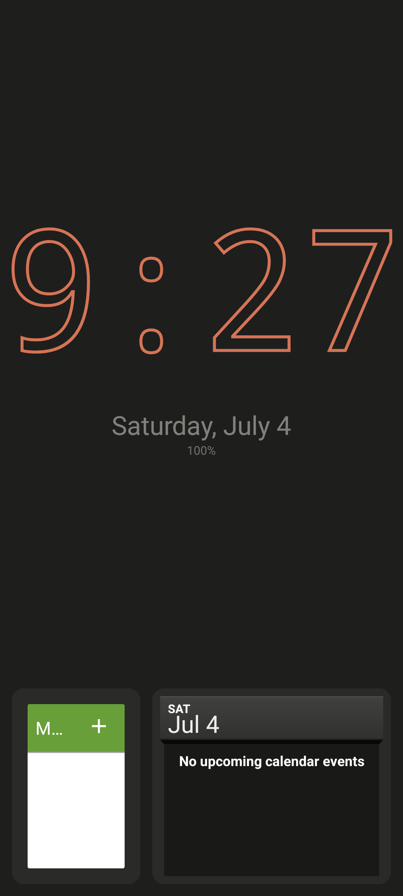
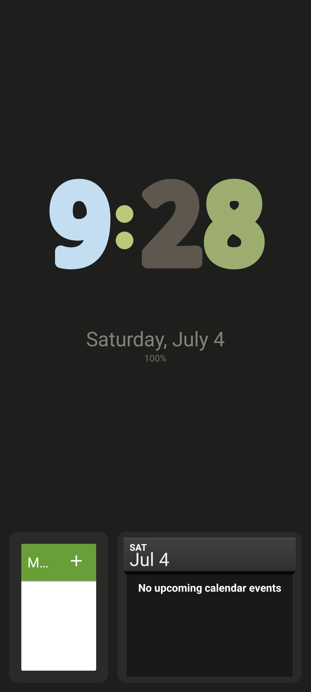
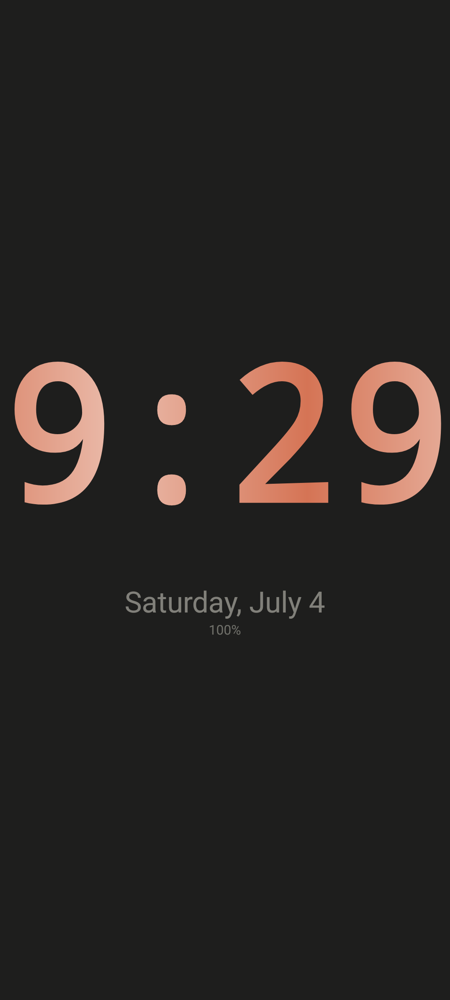
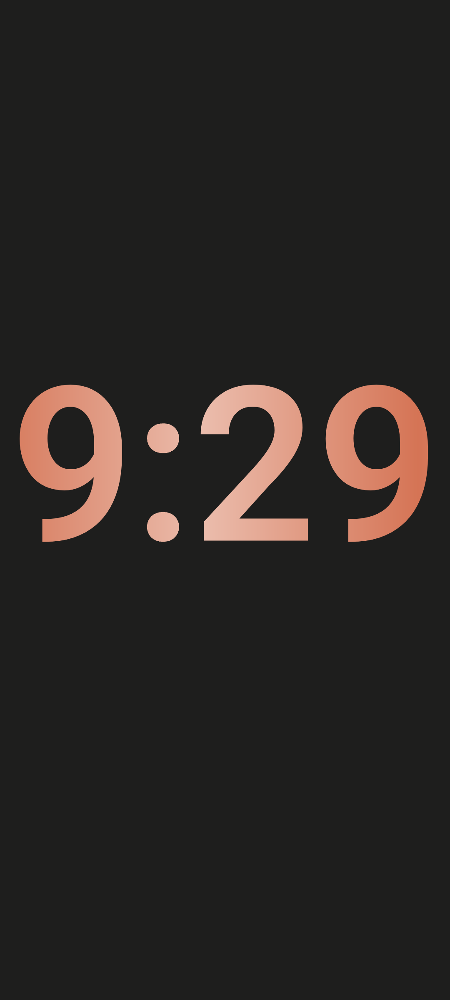
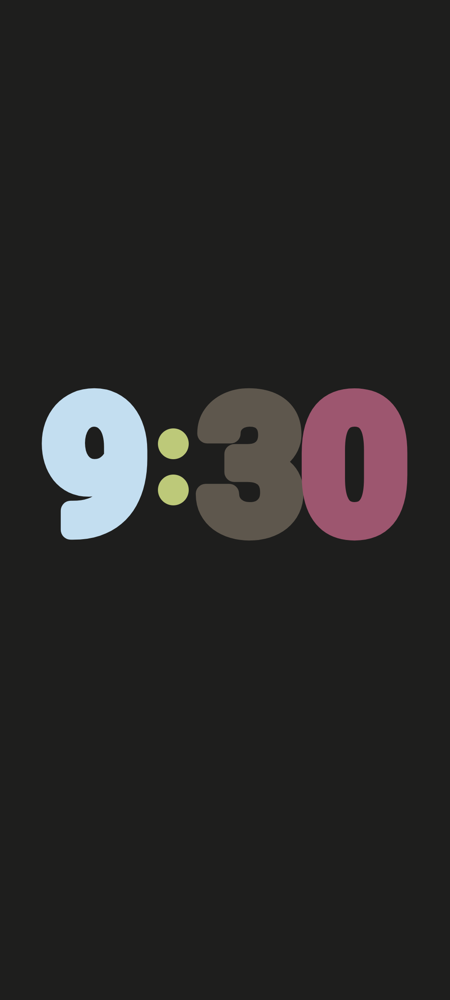
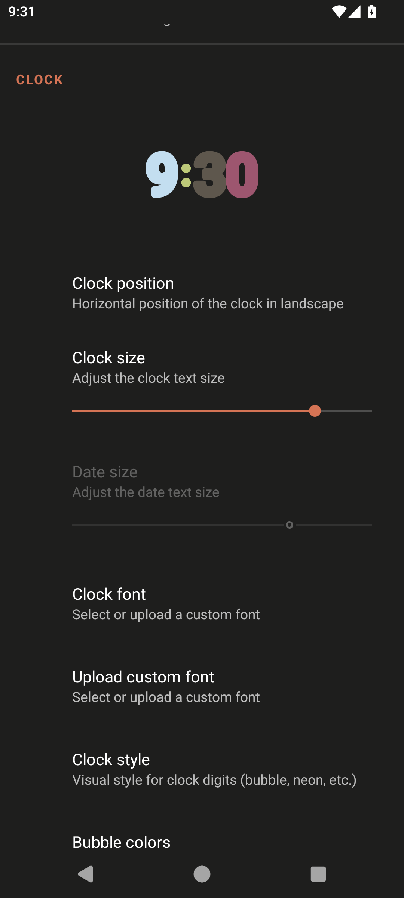
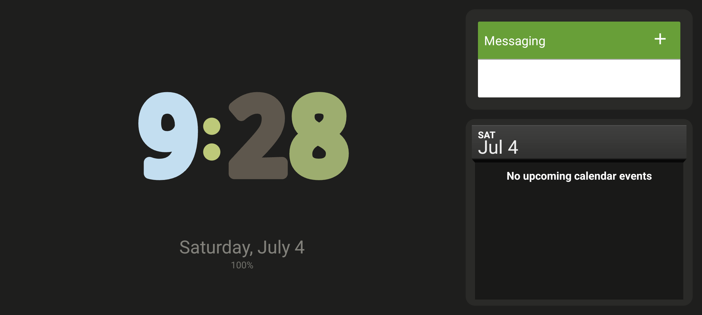

# Dock StandBy

> **This is a personal fork of [Mobinshahidi/Dock](https://github.com/Mobinshahidi/Dock)** (Apache 2.0),
> reshaped to behave like iOS StandBy. It installs alongside the original as
> `io.github.sharkusmanch.dock`.
>
> What differs from upstream:
> - **Three pages, swiped sideways:** Widgets, Photos, Clock.
> - **Three clock faces, swiped up/down:** Digital, Analog, Float. These replace the original six styles.
> - **Night Mode:** when the room is dark the whole screen dims and turns red, driven by the light sensor. This replaces the scheduled night dim.
> - **Double-tap** the Photos or Clock page to leave the screensaver.
> - Widgets are display-only while the phone is locked.
>
> The rest of this README is upstream's and describes the original app; its
> feature list and screenshots do not match this fork.

---

# Dock — Minimal Futuristic Charging Screensaver for Android

<p align="center">
  
  
  
  
</p>

<p align="center">
  <b>A native Android screensaver (DreamService) that transforms your charging phone into a sleek, customizable bedside display.</b><br>
  Inspired by iOS StandBy, but with its own <i>original minimal/futuristic identity</i> — zero ads, zero tracking, zero network.
</p>

---

## Screenshots

<p align="center">
  
  
  
  
  
  
  
</p>

---

## Features

### Core Experience
- **DreamService** — registers as your system screensaver; activates automatically while charging
- **6 distinct clock styles** — Default, Bubble, Neon, Gradient, Mono, Outline — each with its own personality
- **Per-style color pickers** — hex input + RGB sliders for granular control
- **Live settings preview** — see your clock style and color changes instantly without leaving settings
- **Custom font upload** — import `.ttf` or `.otf` files from your device storage

### Clock Styles
| Style | Vibe |
|-------|------|
| **Default** | Clean, minimal, always readable |
| **Bubble** | Playful per-digit coloring — assign a different color to each digit and colon |
| **Neon** | Glowing electric aesthetic with bloom effect |
| **Gradient** | Multi-color sweep across the time string (2+ color stops, add/remove live) |
| **Mono** | Bold single-weight monoline for a technical/industrial feel |
| **Outline** | Hollow strokes with transparent centers — modern and airy |

### Photo Slideshow
- **System photo picker** — no storage permission needed; uses Android's modern picker API
- **Crossfade transitions** — smooth fade between photos
- **Scrim overlay** — readable clock/widget text over any image
- **Configurable interval** — set how long each photo stays on screen
- **Smooth on/off** — enable or disable without losing your photo selection

### Live Widgets
- **AppWidgetHost integration** — drop real Android widgets on your screensaver canvas
- **Multi-slot management** — 1 to 3 widget slots with individual sizing
- **Per-orientation visibility** — show/hide the widget rail independently in portrait and landscape
- **Flexible rail height** — compact, medium, or tall to fit different widget sizes

### Smart Display
- **OLED mode** — true black (`#000000`) background for AMOLED displays
- **Night auto-dim** — configurable time range; automatically dims accent colors during sleep hours
- **Shake physics** — accelerometer triggers a satisfying per-digit spring + sine drift animation on the clock
- **Responsive sizing** — clock auto-scales to fit screen width in both orientations
- **24h / 12h toggle** — respects your time format preference

### Additional Controls
- **Independent date & battery colors** — set separate colors, separate from the clock
- **Font size scaling** — fine-tune the clock, date, and battery text sizes as a percentage
- **Clock position** — left-aligned or centered
- **Transition animation toggle** — enable/disable the minute-change morph effect
- **Settings theme** — light, dark, or follow system

### Privacy First
- **Zero network calls** — no internet permission
- **No analytics, telemetry, or ads** — fully open source
- **No storage permission** — uses Android's system photo picker
- **No location** — your position stays on your device

---

## Design Language

<p align="center">
  <code style="background:#1e1e1d; color:#c3c2b7; padding:2px 6px">Background #1e1e1d</code>
  <code style="background:#c3c2b7; color:#1e1e1d; padding:2px 6px">Text #c3c2b7</code>
  <code style="background:#d57455; color:#fff; padding:2px 6px">Accent #d57455</code>
</p>

- **Warm near-black** background (`#1e1e1d`) or true OLED black (`#000000` option)
- **Warm off-white** primary text (`#c3c2b7`) — easy on the eyes in dark rooms
- **Terracotta accent** (`#d57455`) — active states, glow effects, and progress indicators
- **Thin/light typography** (`fontWeight=300`) with large clock rendering (~120sp)
- **Settings** adapts to light/dark with a warm beige surface (`#F7F4EF`) in day mode

---

## Requirements

| Requirement | Detail |
|-------------|--------|
| **Android** | 8.0+ (API 26) — `minSdk 26` for stable `AppWidgetHost` |
| **Target** | Android 14 (API 34) |
| **Compatibility** | GrapheneOS, stock AOSP, and most custom ROMs |
| **Permissions** | None required for core usage; photo picker uses system UI |
| **Network** | Not needed — the app makes zero network calls |

---

## Getting Started

### Install

1. Download the latest APK from the [Releases](https://github.com/Mobinshahidi/Dock/releases) page
2. Open the downloaded APK on your device and tap **Install**
3. Open **Settings → Display → Screen saver** → select **Dock**
4. Set "When to start screen saver" → **While charging**
5. Plug in and enjoy

### Configure

Open the Dock app from your launcher to access the full settings panel:

- Pick your **clock style** and **color** from the live preview
- Add **photos** for the slideshow background
- Drop **widgets** into the slot rail
- Toggle **OLED mode** and **night dim** for bedtime
- Upload a **custom font** for a truly personal look

---

## Project Structure

```
Dock/
├── app/
│   ├── src/main/
│   │   ├── java/com/nousresearch/dock/
│   │   │   ├── dream/           # DockDreamService + AnimatedClockView
│   │   │   ├── settings/        # SettingsActivity + ClockStylePreviewPreference
│   │   │   ├── slideshow/       # PhotoSlideshowManager — crossfade engine
│   │   │   └── widget/          # WidgetHostManager — AppWidgetHost integration
│   │   ├── res/
│   │   │   ├── layout/
│   │   │   │   ├── dream_dock.xml
│   │   │   │   └── dream_dock_land.xml
│   │   │   ├── xml/
│   │   │   │   ├── dream_config.xml
│   │   │   │   └── settings_preferences.xml
│   │   │   ├── values/
│   │   │   │   ├── colors.xml
│   │   │   │   ├── strings.xml
│   │   │   │   ├── themes.xml
│   │   │   │   └── attrs.xml
│   │   │   └── drawable/
│   │   └── AndroidManifest.xml
│   ├── build.gradle.kts
│   └── proguard-rules.pro
├── .github/workflows/build.yml
├── build.gradle.kts
├── settings.gradle.kts
├── gradle.properties
└── LICENSE
```

---

## License

Apache 2.0 — see [LICENSE](LICENSE)
