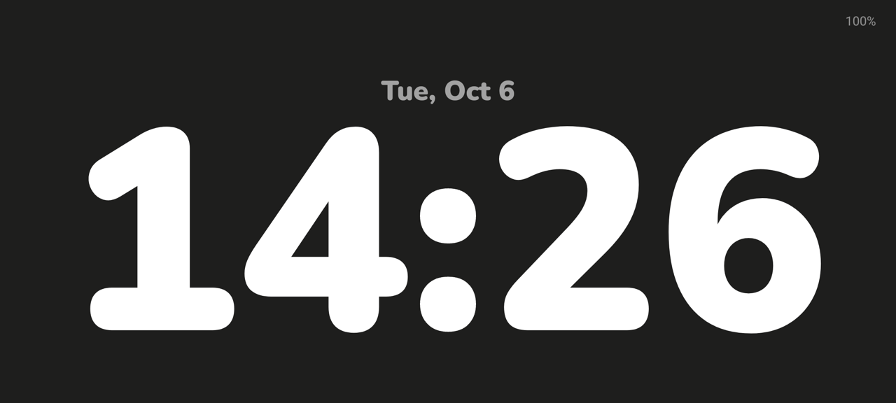
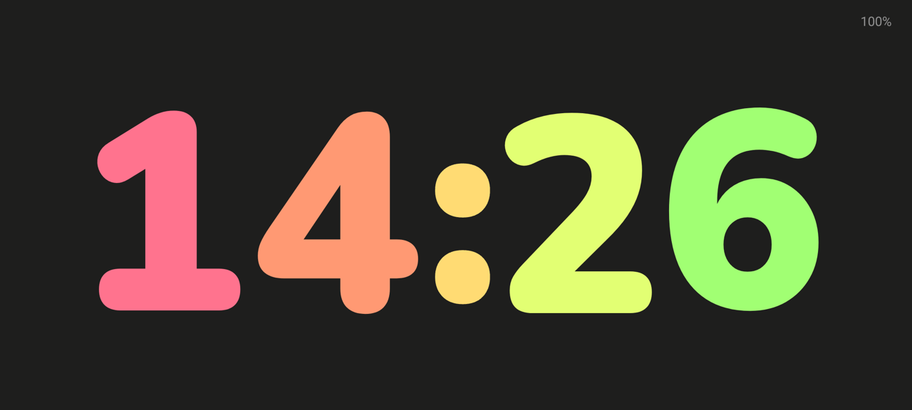
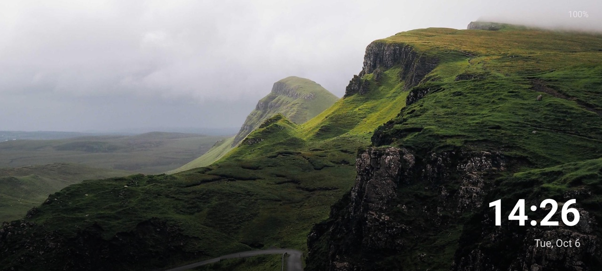
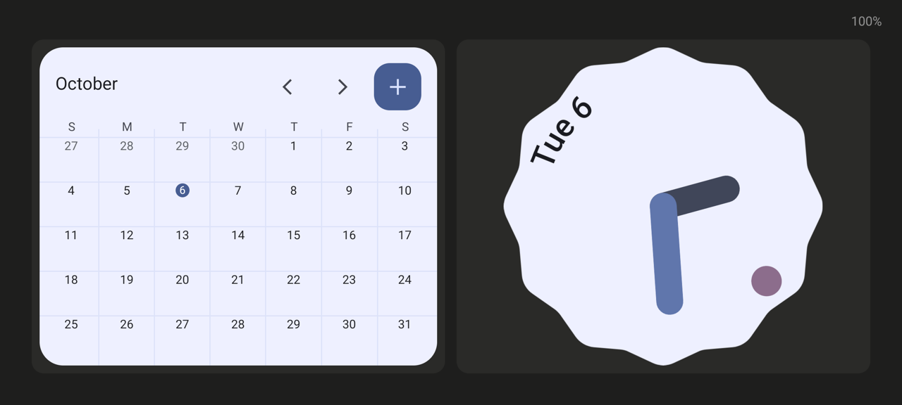
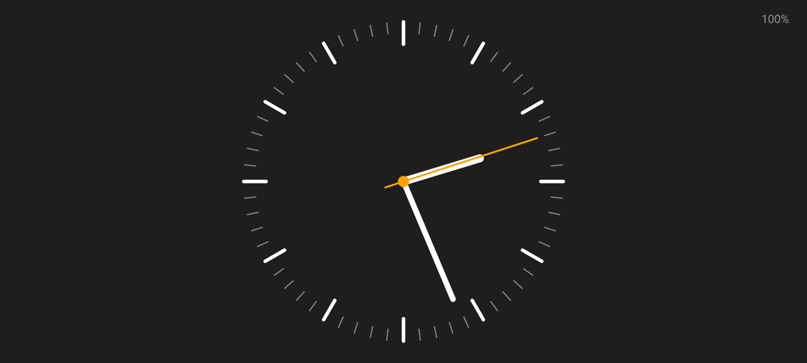
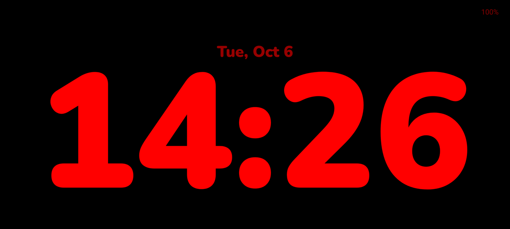
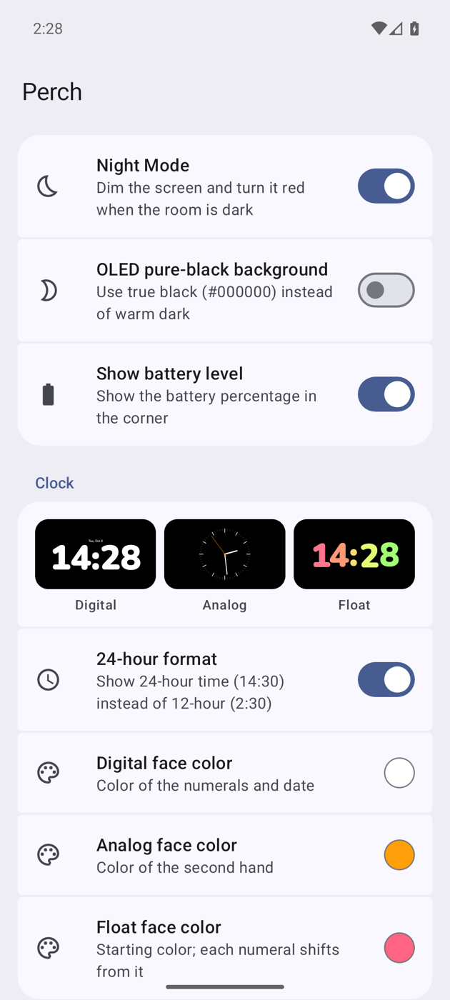

# Perch

**An iOS StandBy-style bedside display for Android.** Put your phone on a charging stand and it becomes a clock, a photo frame or a widget board — and turns dim and red when the room goes dark.

Perch is an Android screen saver (a `DreamService`). It has no ads, no tracking and no internet permission.

<p align="center">
  <a href="https://apps.obtainium.imranr.dev/redirect?r=obtainium%3A%2F%2Fadd%2Fhttps%3A%2F%2Fgithub.com%2Fsharkusmanch%2Fperch"></a>
  <a href="https://github.com/sharkusmanch/perch/releases/latest"></a>
</p>

<p align="center">
  
</p>

> Perch is a fork of [Dock](https://github.com/Mobinshahidi/Dock) by Mobin Shahidi, reshaped to behave like StandBy. See [What changed from Dock](#what-changed-from-dock).

---

## What it does

### Three pages, swiped sideways

| Clock | Photos | Widgets |
|:-----:|:------:|:-------:|
|  |  |  |
| A full-screen clock face | Your photos as a slideshow, with the time in the corner | One to three of your Android widgets, filling the screen |

Perch remembers the page you were on.

### Three clock faces, swiped up and down

| Digital | Analog | Float |
|:-------:|:------:|:-----:|
|  |  |  |
| Large rounded numerals with the date | A dial with a sweeping second hand | Oversized numerals in soft colours that drift slowly |

Each face has its own colour, chosen in settings.

### Night Mode

<p align="center">
  
</p>

When the phone's light sensor reads a dark room, the whole screen — clock, photos and widgets — fades to red on black and drops to minimum brightness. It returns to normal a few seconds after the lights come on. It can be switched off in settings.

### Gestures

| Gesture | Action |
|---------|--------|
| Swipe left / right | Change page |
| Swipe up / down on the Clock page | Change clock face |
| Double-tap the Clock or Photos page | Leave the screen saver |

### Settings

<p align="center">
  
</p>

Open **Perch** from your app drawer:

- **Display** — Night Mode, pure-black background for OLED screens, battery percentage.
- **Clock** — live previews of the three faces, 12/24-hour time, a colour for each face.
- **Photos** — pick photos with the system picker and set how often they change.
- **Widgets** — choose one to three widgets and how much of the page each takes.

Settings follow your phone's light/dark mode and, on Android 12 and later, its wallpaper colours.

---

## Privacy and safety

- **No network access.** The app has no internet permission.
- **No storage permission.** Photos come through Android's system picker.
- **Widgets are display-only while the phone is locked.** A screen saver shows over the lock screen, so Perch does not pass taps, keys or accessibility actions to widgets until the phone is unlocked.

---

## Requirements

| | |
|---|---|
| **Android** | 8.0 (API 26) or later |
| **Night Mode** | Needs an ambient light sensor |
| **Best on** | A stand that holds the phone in landscape while charging |

---

## Install

- **Obtainium:** tap the badge at the top of this page on your phone to add Perch, and Obtainium will keep it updated.
- **Manually:** download the APK from the [latest release](https://github.com/sharkusmanch/perch/releases/latest) and open it on your phone.

### Verify a download

Every release APK is built and signed by this repository's [release workflow](.github/workflows/release.yml). To check a file you downloaded:

```sh
sha256sum --check perch-<version>.apk.sha256
gh attestation verify perch-<version>.apk -R sharkusmanch/perch
```

Releases are signed with a certificate whose SHA-256 fingerprint is
`c28ad1e8d618108cfa26edf8de59b600644c91712d46c3b38d5eb6c8f297bee8`.

### Build from source

You need a JDK (17 or 21) and the Android SDK with platform 34:

```sh
git clone https://github.com/sharkusmanch/perch.git
cd perch
./gradlew assembleDebug
adb install app/build/outputs/apk/debug/app-debug.apk
```

A build you make yourself is signed with your own debug key, so it cannot be installed over a release APK or the other way round.

Perch installs as `io.github.sharkusmanch.dock`, so it can sit alongside the original Dock.

### Set it up

1. Open **Settings → Display → Screen saver** and select **Perch**. (Perch's own settings has a shortcut to this page, which also has a **Preview** button.)
2. Set **When to start** to **While charging**.
3. If it does not start by itself, allow Perch unrestricted battery use and turn off Battery Saver.
4. If your phone has its own low-light screen saver or always-on display that takes over in the dark, turn that off so Night Mode can show.

---

## What changed from Dock

- One fixed screen became three swipeable pages; the screen saver is now interactive.
- The six clock styles (Default, Bubble, Neon, Gradient, Mono, Outline) and their options were replaced by the Digital, Analog and Float faces.
- The scheduled night dim was replaced by Night Mode, driven by the light sensor.
- Widgets moved from a side rail to their own page, and are locked while the phone is locked.
- The settings screen was rebuilt in Material 3.
- Removed: custom font upload, clock position and size sliders, per-digit and gradient colours, the shake animation.

---

## Development

```sh
./gradlew testDebugUnitTest   # unit tests: clock maths and Night Mode logic
./gradlew assembleDebug lintDebug
```

```
app/src/main/java/com/nousresearch/dock/
├── dream/            DockDreamService — the screen saver, paging and Night Mode rendering
│   ├── pages/        Widgets, Photos and Clock pages
│   ├── faces/        Digital, Analog and Float faces; ClockMath
│   └── night/        Light-sensor handling and the Night Mode decision logic
├── settings/         Material 3 settings screen
├── slideshow/        PhotoSlideshowManager
└── widget/           WidgetHostManager and the lock-aware widget slot
```

The design notes for the fork are in [`docs/superpowers/specs`](docs/superpowers/specs).

---

## Credits and license

- [Dock](https://github.com/Mobinshahidi/Dock) by Mobin Shahidi — the app Perch is forked from.
- [Nunito](https://github.com/googlefonts/nunito) typeface, SIL Open Font License 1.1.
- [Material Icons](https://github.com/google/material-design-icons) by Google, Apache License 2.0.
- Sample photo in the screenshots by Andrew Ridley on [Unsplash](https://unsplash.com/photos/Kt5hRENuotI).

Licensed under the Apache License 2.0 — see [LICENSE](LICENSE) and [NOTICE](NOTICE).
